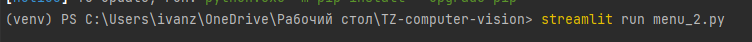
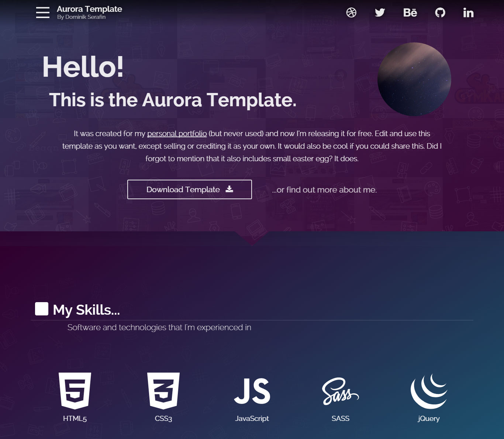
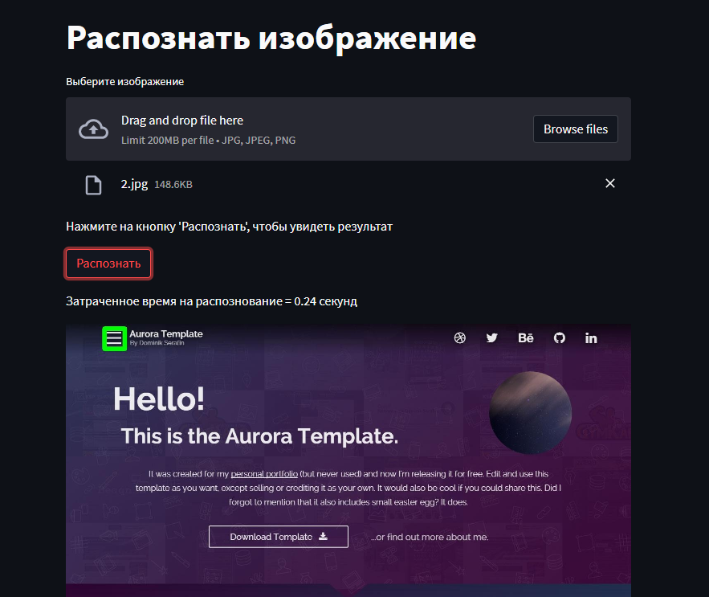

# Description
### Computer-vision
This project is a technical task for the employer. 
I trained a neural network and implemented a functionality that allows you to recognize a burger menu in a screenshot of a mobile version of an arbitrary site. Used openCV for training and streamlit for interface.
---
# How to use the model
1. Download the repository and install a virtual environment inside it.
2. Unpack libraries from requirements.txt file
3. In PowerShell, write the command streamlit run menu_2.py
  
4. After running the command you have run localhost.
5. Take any photo that has a burger menu and upload it.
  
  
6. Click the recognize button and get the result. The burger menu button will have a green border around it.
  
  ---
  > In order to forward the local port to the Internet, I used ngrok.
